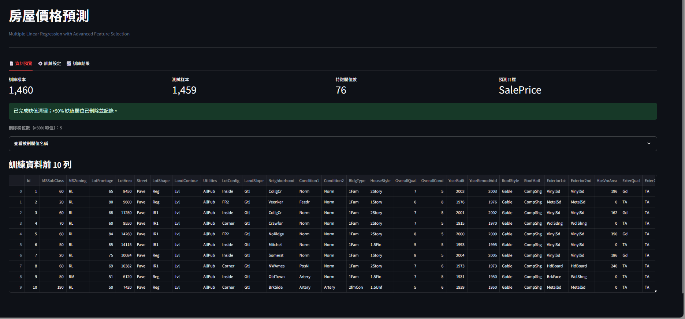
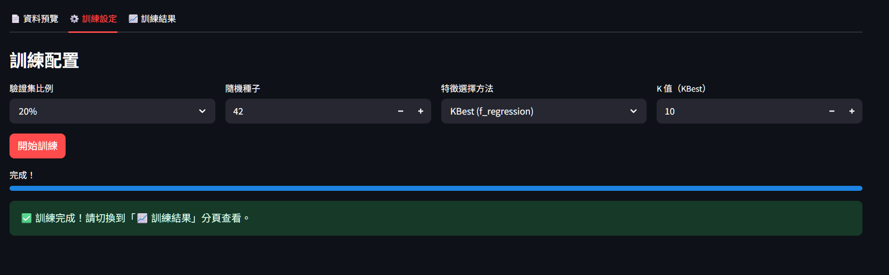
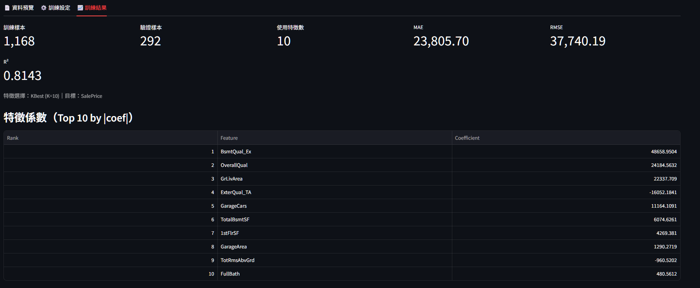
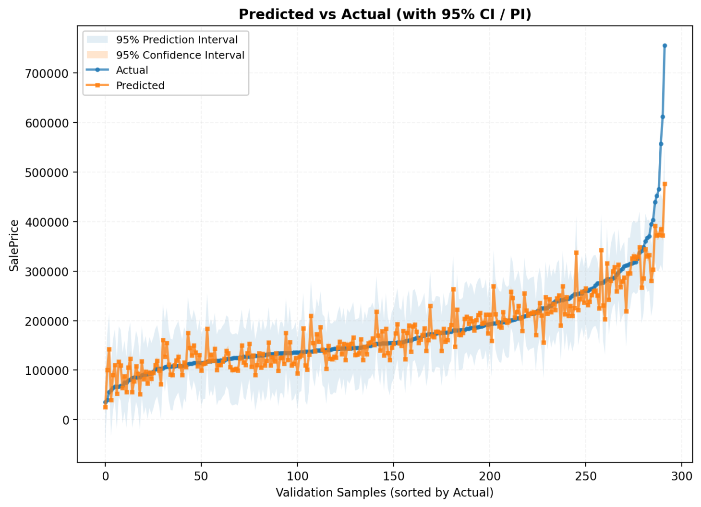
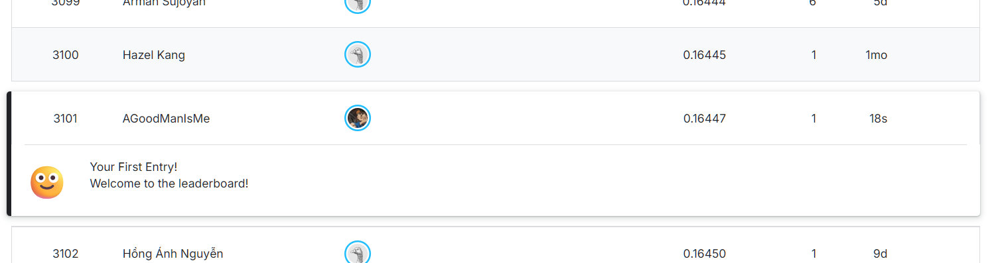

# 房價預測（Ames Housing）—多元線性回歸（OLS）報告（**Streamlit 版**）

> **目標**：以可重現、低延遲的 **單檔 Streamlit** 介面完成從資料理解到建模與評估的 **CRISP-DM** 流程，並在可解釋性前提下達到穩定的驗證表現。
Deployement: [https://aiot-hw2.streamlit.app/](https://aiot-hw2.streamlit.app/)
---

## 1. 資料來源

* **主題**：房價預測（Ames Housing）
* **來源**：Kaggle「House Prices – Advanced Regression Techniques」
* **連結**：[https://www.kaggle.com/c/house-prices-advanced-regression-techniques](https://www.kaggle.com/c/house-prices-advanced-regression-techniques)
* **檔案**：`dataset/train.csv`、`dataset/test.csv`（皆置於專案 `dataset/` 目錄）
* **使用方式**：本作業以 `train.csv` 進行訓練／驗證切分；`test.csv` 僅用於介面顯示資料規模。

> **執行**：`streamlit run app.py`（不需上傳檔案；App 會直接讀取 `dataset/` 內的 CSV）

---

## 2. 分析任務定義

* **預測目標（Target）**：`SalePrice`
* **模型（Baseline）**：多元線性回歸（**OLS**）
* **特徵選擇**：支援 `SelectKBest(f_regression)` 與 `L1/Lasso`；**本次設定：KBest，K=10**
* **評估指標**：`MAE`、`RMSE`、`R²`
* **視覺化**：Predicted vs Actual 折線圖，附 **95% CI**（平均預測信心區間）／**95% PI**（新觀測預測區間）

---

## 3. 方法論（對應 CRISP-DM）

### 3.1 Business Understanding

* **目標**：以低門檻、可重現的 **Web** 流程，協助學生完成房價回歸任務、理解關鍵特徵與不確定性（CI/PI）。
* **交付**：**Streamlit** 互動介面（分頁式）＋報告（方法、指標、圖表）。

### 3.2 Data Understanding

* 介面提供 **Metrics 卡片**、**Expander** 與 **DataFrame 預覽**：顯示基本統計、欄位型態與缺值情形；`SalePrice` 為連續值，符合回歸設定。

*Figure 1. Data preview（Streamlit 預覽頁）*

> 初步觀察：同時包含**數值**與**類別**欄位，且存在缺值。

### 3.3 Data Preparation

* **缺值處理**

  * 缺值比例 **> 50%**：整欄移除
  * 其餘：數值以**中位數**、類別以**眾數**填補
* **編碼與標準化**

  * 類別：`OneHotEncoder(handle_unknown="ignore")`
  * 數值：`StandardScaler`
* **資料切分**：訓練／驗證 = **80%／20%**（`random_state=42`）
* **特徵選擇**：`SelectKBest(f_regression)`，**K=10**

> App 透過 `st.cache_data` 快取載入與清理，並以 `session_state` 在分頁間傳遞結果。

### 3.4 Modeling

* 使用 **statsmodels OLS** 訓練，並輸出：

  * **95% Confidence Interval（CI）**：平均預測之不確定性
  * **95% Prediction Interval（PI）**：單一新觀測之不確定性
* **備援**：若 OLS 因設計矩陣或數值問題失敗，退回 `sklearn.LinearRegression`，並以殘差近似區間以利視覺化。

*Figure 2. 訓練設定（Streamlit Tabs 與控制項）*

### 3.5 Evaluation

* **驗證集結果**（本次實驗截圖數值）

| Metric   |       Score |
| -------- | ----------: |
| **MAE**  | ≈ 23,805.70 |
| **RMSE** | ≈ 37,740.19 |
| **R²**   |    ≈ 0.8143 |

* **Top-10 係數**（依 |coef| 由大至小；KBest, K=10）

| 排名 | 特徵             |     係數（約略） |
| -: | -------------- | ---------: |
|  1 | `BsmtQual_Ex`  |  48,685.95 |
|  2 | `OverallQual`  |  24,184.56 |
|  3 | `GrLivArea`    |  22,337.71 |
|  4 | `ExterQual_TA` | −16,052.18 |
|  5 | `GarageCars`   |  11,164.11 |
|  6 | `TotBsmtSF`    |   6,074.63 |
|  7 | `1stFlrSF`     |   4,269.38 |
|  8 | `GarageArea`   |   1,290.28 |
|  9 | `TotRmsAbvGrd` |    −960.52 |
| 10 | `FullBath`     |     480.56 |

*Figure 3. Validation metrics & Top coefficients（Streamlit 結果頁）*

* **Predicted vs Actual（含 95% CI / 95% PI）**

  * **藍線**：Actual；**橘線**：Predicted；**陰影**：CI/PI
  * **觀察**：整體趨勢擬合良好；高價尾端有輕微低估／高估現象。

*Figure 4. Predicted vs Actual（with 95% CI / PI）*

### 3.6 Deployment

* **單檔 Streamlit**：`app.py`
* **分頁式介面**：資料預覽／訓練設定／訓練結果（以 `st.tabs` 實作）
* **作圖**：後端以 Matplotlib 產生並以 `st.pyplot` 顯示（無需額外外掛）
* **流程自動化**：缺值處理、特徵工程、特徵選擇、區間計算皆於伺服端完成，利於**批改**與**重現**
* **執行命令**：`streamlit run app.py`

---

## 4. Kaggle 名次（若有）

> 若同步使用此流程提交至 Kaggle，於此處呈現公開或私榜名次與對照說明；若僅本地驗證，可改為**班內排名**或**自定對照實驗**。

*Figure 5. Kaggle ranking (if applicable)*

---

## 5. GPT 輔助內容（需保留）

* 需求澄清與系統設計（分頁式 UI、指標與圖形規格、CI/PI 呈現）
* **Streamlit** 單檔原始碼撰寫與重構（缺值處理、One-Hot＋標準化、KBest/Lasso、OLS 與備援）
* 指標計算、Top-k 係數表與 Predicted vs Actual＋95% CI/PI 圖產製
* 報告撰寫（CRISP-DM 條列、簡要公式、圖說英文化以避免字型問題）

---

## 6. NotebookLM 研究摘要（>100 字）

本研究以「房價多元線性回歸」為題，NotebookLM 蒐整之常見流程包括：（1）**資料清理與合理化**：對極端值與缺值採 IQR 與中位數／眾數策略，必要時對偏態變數取對數以穩定線性關係；（2）**特徵工程**：具順序性的品質評等轉為有序數值，名目類別 One-Hot，面積／房齡等連續變數標準化，並輔以 KBest／L1 控制維度以提升穩健性與可解釋性；（3）**模型與區間**：使用 statsmodels OLS 擬合，提供係數與顯著性檢定，並同時輸出 CI（平均估計）與 PI（新觀測）以利決策風險評估；（4）**評估與比較**：核心以 MAE、RMSE、R²，並輔以 Learning Curve 與高價尾端殘差分析觀察偏差—變異；若追求更低誤差，常比較 Ridge/Lasso/ElasticNet 或樹系（RF、XGBoost），惟可解釋性與區間推論需求時，MLR 仍是教學與基準的關鍵選擇。

## GPT Prompt
[https://chatgpt.com/share/68e89e53-8f50-8013-bf51-01f4b4885fad](https://chatgpt.com/share/68e89e53-8f50-8013-bf51-01f4b4885fad)
